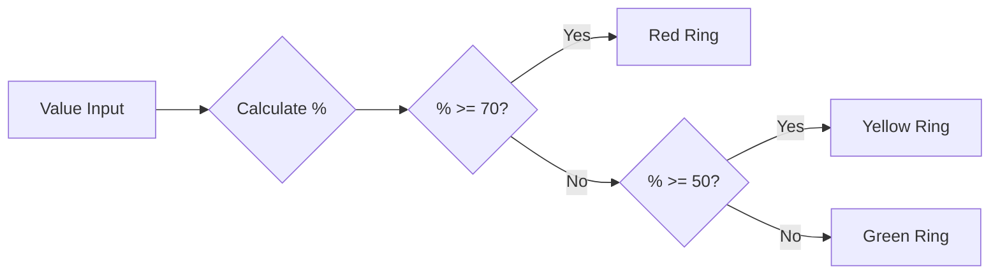

# ProcessCircle Widget

An IBM Business Automation Workflow (BAW) custom coach view widget that displays numeric progress as an animated circular indicator with Carbon Design System styling and dynamic color-coded visual feedback.

## Overview

The ProcessCircle widget provides a visually appealing way to represent numeric progress or status values in IBM BAW applications. It features:

- **Animated circular progress bar** with smooth 2-second animation
- **Carbon Design System integration** with theme-aligned colors and typography
- **Dynamic color-coding** based on percentage thresholds (Green → Yellow → Red)
- **Configurable value ranges** (min/max)
- **Customizable display suffix** (%, pts, items, etc.)
- **Configurable sizing** (circle size and ring thickness)
- **Accessibility support** with proper ARIA attributes
- **Responsive design** with mobile-friendly breakpoints
- **Error handling** with validation and console logging

## Visual Representation

```
    ┌─────────────┐
    │             │
    │     65%     │  ← Value displayed in center
    │             │
    └─────────────┘
         ↑
    Colored ring showing progress
```

### Color-Coded States

The progress ring automatically changes color based on the percentage value:

| Percentage Range | Color | Carbon Variable | Meaning |
|-----------------|-------|-----------------|---------|
| 0% - 49%        | 🟢 Green | `#198038` (@bpm-color-success) | Normal/Good |
| 50% - 69%       | 🟡 Yellow | `#f1c21b` (@bpm-color-warning) | Warning/Caution |
| 70% - 100%      | 🔴 Red | `#da1e28` (@bpm-color-alert) | Critical/Alert |

## Configuration Options

| Option | Type | Default | Description |
|--------|------|---------|-------------|
| `MinValue` | Integer | `0` | Minimum value for the range |
| `MaxValue` | Integer | `100` | Maximum value for the range |
| `postParameter` | String | `"%"` | Suffix text displayed after the value |
| `CircleSize` | String | `"12rem"` | Overall size of the circle (CSS value) |
| `RingThickness` | String | `"0.5rem"` | Thickness of the progress ring (CSS value) |

## Business Data

### Input Data

- **Type**: Integer
- **Description**: The numeric value to be displayed in the progress circle
- **Validation**: Automatically clamped between MinValue and MaxValue
- **Calculation**: The widget automatically calculates the percentage:
  ```
  percentage = ((value - MinValue) / (MaxValue - MinValue)) × 100
  ```

### Example

If `MinValue = 0`, `MaxValue = 200`, and `value = 150`:
```
percentage = ((150 - 0) / (200 - 0)) × 100 = 75%
```
The circle displays "150%" (or "150" with custom postParameter) with a red ring (75% ≥ 70%).

## File Structure

```
ProcessCircle/
├── README.md                          # This file
├── ProcessCircle.svg                  # Widget palette icon (120x120px)
├── widget/                            # Widget implementation files
│   ├── Layout.html                    # Semantic HTML structure
│   ├── InlineCSS.css                  # Carbon Design System styling
│   ├── inlineJavascript.js            # Initialization logic
│   ├── config.json                    # Widget metadata
│   ├── datamodel.md                   # Data model documentation
│   ├── eventHandler.md                # Event handler documentation
│   └── events/
│       └── change.js                  # Data change event handler
└── AdvancePreview/                    # BAW Designer preview
    ├── ProcessCircle.html             # Preview styles
    └── ProcessCircleSnippet.js        # Preview integration (mixObject)
```

## Component Files

### Layout.html
Defines the semantic HTML structure with proper accessibility:
```html
<div class="process-circle-container">
    <div class="process-circle" 
         role="progressbar" 
         aria-label="Progress indicator"
         aria-valuenow="0" 
         aria-valuemin="0" 
         aria-valuemax="100" 
         data-post="%">
    </div>
</div>
```

### InlineCSS.css
Contains Carbon Design System styling:
- CSS custom properties for dynamic theming
- Keyframe animation for smooth progress transitions
- Conic gradient for circular progress visualization
- Color transitions based on percentage thresholds
- Responsive breakpoints for mobile devices
- IBM Plex Sans typography

### inlineJavascript.js
Handles initialization with error handling:
```javascript
var _this = this;
var processCircle = _this.context.element.querySelector('.process-circle');
var currentValue = _this.getData() || 0;
processCircle.style.setProperty("--value", currentValue);
```

### events/change.js
Updates the widget when data changes:
- Validates value range
- Updates ARIA attributes
- Updates CSS custom properties
- Logs changes for debugging

## Usage Examples

### Basic Configuration

1. **Add the ProcessCircle widget** to your IBM BAW coach view
2. **Bind the business data** to an integer variable
3. **Configure the options**:
   ```
   MinValue: 0
   MaxValue: 100
   postParameter: "%"
   CircleSize: "12rem"
   RingThickness: "0.5rem"
   ```

### Example: Task Completion Tracker

```javascript
// Business data: completedTasks = 45 (out of 60 total tasks)
// Configuration:
MinValue: 0
MaxValue: 60
postParameter: " tasks"
CircleSize: "12rem"
RingThickness: "0.5rem"

// Result: Displays "45 tasks" with yellow ring (75% completion)
```

### Example: Performance Score

```javascript
// Business data: performanceScore = 85
// Configuration:
MinValue: 0
MaxValue: 100
postParameter: "%"
CircleSize: "15rem"
RingThickness: "0.75rem"

// Result: Displays "85%" with red ring (85% ≥ 70%)
```

### Example: Custom Range

```javascript
// Business data: temperature = 75 (degrees)
// Configuration:
MinValue: 0
MaxValue: 150
postParameter: "°F"
CircleSize: "10rem"
RingThickness: "0.5rem"

// Result: Displays "75°F" with green ring (50% < 50%)
```

## Technical Details

### CSS Custom Properties

| Property | Description | Default |
|----------|-------------|---------|
| `--value` | Current value | `0` |
| `--min` | Minimum value | `0` |
| `--max` | Maximum value | `100` |
| `--circle-size` | Overall circle size | `12rem` |
| `--size` | Ring thickness | `0.5rem` |
| `--pgPercentage` | Calculated percentage | `0` |

### Carbon Design System Colors

| Variable | Value | Usage |
|----------|-------|-------|
| `--color-success` | `#198038` | Green (0-49%) |
| `--color-warning` | `#f1c21b` | Yellow (50-69%) |
| `--color-error` | `#da1e28` | Red (70-100%) |
| `--color-bg` | `#e0e0e0` | Background ring (Gray 20) |
| `--color-text` | `#161616` | Center text (Gray 100) |

### Animation

- **Duration**: 2 seconds
- **Timing**: Ease-out with 33% delay at start
- **Effect**: Smooth growth from 0 to target value
- **Iteration**: Runs once on load/update

### Accessibility

The widget implements proper ARIA attributes:
- `role="progressbar"`: Identifies the element as a progress indicator
- `aria-label="Progress indicator"`: Provides accessible name
- `aria-valuenow`: Current value
- `aria-valuemin`: Minimum value
- `aria-valuemax`: Maximum value

### Responsive Design

```css
/* Desktop: 12rem circle, 24px font */
@media (max-width: 768px) {
    /* Tablet: 10rem circle, 20px font */
}
@media (max-width: 480px) {
    /* Mobile: 8rem circle, 18px font */
}
```

## Color Threshold Logic



## Browser Compatibility

The widget uses modern CSS features:
- CSS Custom Properties (CSS Variables)
- CSS `@property` for animated custom properties
- Conic gradients
- CSS Grid
- CSS Masks

**Recommended browsers**: Chrome 85+, Firefox 90+, Safari 14+, Edge 85+

## Integration with IBM BAW

This widget is designed as a custom Coach View for IBM Business Automation Workflow:

1. Import the widget into your Process App or Toolkit
2. Add it to a Coach or Coach View
3. Bind the business data to an integer variable
4. Configure the Min/Max values and display options
5. The widget automatically updates when the bound data changes

## Preview Integration

The widget includes BAW Designer preview support using the mixObject pattern:
- Dynamic preview generation with sample data
- Property change handling for live updates
- Model change handling for data binding updates
- Proper integration with BPMExt-Controls.preview.js

## Error Handling

The widget includes comprehensive error handling:
- Element existence validation
- Value range clamping
- Default value fallbacks
- Console error logging
- Try-catch blocks in all JavaScript files

## License

```
Licensed Materials - Property of IBM
5725-C95
(C) Copyright IBM Corporation 2026
```

---

**Version**: 2.0  
**Last Updated**: 2026  
**IBM BAW Compatibility**: IBM Business Automation Workflow v18.0+  
**Carbon Design System**: Aligned with Carbon v11